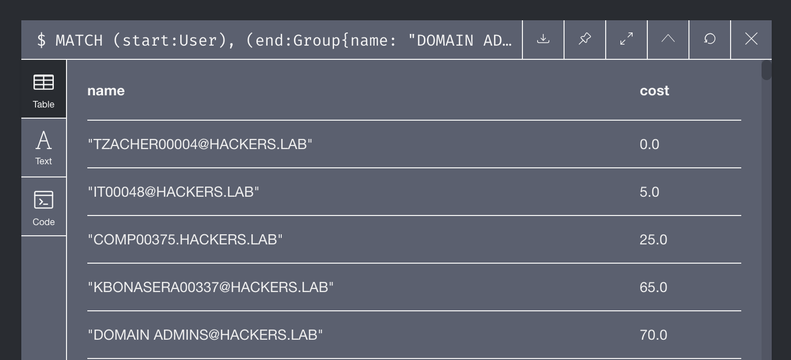
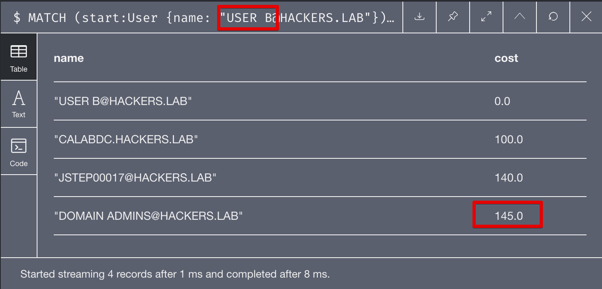

## Introduction

[BloodHound](https://github.com/BloodHoundAD/) was a revolution for evaluating Active Directory (AD) security and identifying unintended paths that could lead to the compromise of sensitive groups such as Domain Admins. The community has been using it successfully in many engagements and against highly secure environments.

For those who've been living in a cave for the past couple of years, in a nutshell BloodHound is a tool that can be used by both defenders and attackers to identify hidden and unintended relationships between AD principals. It's heavily based on the work published by Microsoft's researchers: [Heat-ray: Combating Identity Snowball Attacks Using Machine Learning, Combinatorial Optimization and Attack Graphs](https://www.microsoft.com/en-us/research/publication/heat-ray-combating-identity-snowball-attacks-using-machine-learning-combinatorial-optimization-and-attack-graphs/). Although BloodHound does not rely on machine learning yet, the data model is pretty similar to the proposed one.

An example of the relationships created using BloodHound:


This article is mainly based on some research that I've been doing recently on attack paths and graph theory (although this specific article will not be focused on graph theory).

Let's start with a consideration about BloodHound:

**Not all the attack paths have the same easiness of exploitability**; some of them are easier to exploit or abuse and some other are, by nature, harder.

Let's make a couple of **examples** and **edge cases** to clarify the concept:

* Let's suppose that User A is effectively part of the Domain Admins group, not directly but through several nested group memberships, let's make it 5 for the sake of this example. In this case the distance of User A to Domain Admins is 6.


* User B, is not part of the Domain Admin groups, but for some reason he's able to RDP into the Domain Controller where a Domain Admin is logged on. In this case the distance to Domain Admins is 3.


But let's think about it for a second, what's easier to exploit? If we follow the "shortest path" algorithm, clearly User B is closer. However, if you've ever done an AD assessment in the real live you'll quickly realise that:

* User B can RDP into the Domain Controller, however before doing any privileged action they need to perform some sort of privesc.
* After performing a privilege escalation, User B still needs to compromise the DA user logged on (or extract the hashes from the DC itself).

In the other case, User A is already a DA and doesn't need to do anything at all (except from DCSync'ing maybe?).
I do realise that the proposed example is quite forced and in a real scenario you would realise that the user you compromise is a DA. But you get the idea right?

We could look at this problem from an opsec perspective as well, what are the most noisy actions you could do? Probably resetting a DA password should be the last resort if detection is something you care about.

Hopefully I convinced you that not all the paths that are identified by BloodHound are equal, both from a practical and an opsec perspective. The approach I propose involve the use of **weighted** connections between the different nodes, the weight of a connection or **cost** for those who are familiar with graph theory can be interpreted as follows:

* From an opsec perspective, the cost of a connection will be directly proportional to the chances that performing that action will create alerts;
* From a practical perspective, the cost could be inversely proportional to how easy is to exploit a specific connection. In the RDP example we already mentioned, the `CanRDP` link would have a higher cost compared to `MemberOf`.


In the tables below I will propose some of the costs associated with the relationship types within BloodHound:

Relationship | Opsec | Easiness
--- | --- | ---
CanRDP | 70 | 100
CanPSRemote  |  60 |  100
ExecuteDCOM  |  60 |  100
HasSession  | 40  |  40
Write/GenericAll/ForceChangePwd  | 30  |  30
AdminTo  |  20 |  20
MemberOf | 5 | 5

These values are *purely arbitrary* and come from my experience, don't take those for gold and don't kill me if you don't agree. It's just an example and those values may change depending on your team capabilities, tooling, experience and so on! Feel free to give me feedbacks and I will update the table accordingly.

## Implementation
Now, neo4j does not support weighted connections out of the box. Luckily for us, there are several modules we can import that would allow us to calculate shortest paths using link costs. The plugin we're looking for in this case is [Neo4j Graph Algorithms](https://github.com/neo4j-contrib/neo4j-graph-algorithms).

Since I'm cool and I have a MacBook, I always use the Desktop version of Neo4j. It's quite easy to install the aforementioned plugin:


Let's now set the costs accordingly to our table (in this example just from easiness to exploit, not opsec):

```cypher
MATCH ()-[r]->()
SET r.cost = 30

MATCH ()-[r:CanRDP|CanPSRemote|ExecuteDCOM]->()
SET r.cost = 100

MATCH ()-[r:HasSession]->()
SET r.cost = 40

MATCH ()-[r:AdminTo]->()
SET r.cost = 20

MATCH ()-[r:MemberOf]->()
SET r.cost = 5
```

Let's suppose we now want to find the shortest path to Domain Admins from a normal user, we could use a query like this one:

```
MATCH (start:User), (end:Group{name: "DOMAIN ADMINS@HACKERS.LAB"})
CALL algo.shortestPath.stream(start, end, 'cost',{write:true,writeProperty:'sssp', direction:'OUTGOING'})
YIELD nodeId, cost
RETURN algo.asNode(nodeId).name AS name, cost
```

Let's briefly explain what the query does:

* The `MATCH` operator is used to identify the starting and the ending nodes, modify accordingly to your needs;
* The `CALL` function uses the external plugin we previously installed using the Dijkstra algorithm, for more references refer to the [documentation](https://neo4j.com/docs/graph-algorithms/current/labs-algorithms/shortest-path/).
  - Other than the starting and the ending nodes, I provided some additional options that specify the direction of the path we want to find (outgoing in this case)
  - the `writeProperty` parameter will instruct the algorithm to write an incremental index to every node that is part of a path, may be useful for other types of processing

An example of output is shown below:



In the figure, it is possible to see all the steps and their relative cost, note that the output may contain different paths with the same cost!

If we repeat the same cypher query but from User A and User B that we introduced in the example, we'll see that the path from User B is much more expensive, although it requires less steps.

For User A:


and for User B:



We just demonstrated that it is possible to set costs to various links between nodes and identify the shortest paths with the smallest cost!
Hopefully this initial research will be continued and will help both red teamers and defenders to identify the path with the **least resistance** that could help us reaching our objectives!
