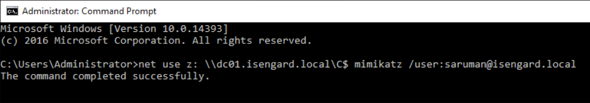

<!-- MDTOC maxdepth:6 firsth1:1 numbering:0 flatten:0 bullets:1 updateOnSave:1 -->

   - [Introduction](#introduction)   
   - [Attack Execution](#attack-execution)   
   - [Detection](#detection)   
   - [Other Detections and Indicators](#other-detections-and-indicators)   
   - [References](#references)   

<!-- /MDTOC -->

## Introduction

During a [recent presentation](https://github.com/RiccardoAncarani/talks/tree/master/r00tMI) I examined various ways of persisting within Active Directory (AD) and how every technique can be detected, using both intrinsic IoC of the specific technique or tooling default behaviour. One of the analysed attacks was the [skeleton key](https://attack.mitre.org/software/S0007/) implant.

At an high level, skeleton key is an attack where an adversary deploys some code in a Domain Controller that alters the normal Kerberos/NTLM authentication process. Doing so, the attackers would have the ability to use a secondary and arbitrary password to impersonate any user within the domain, but without the operational risk of changing the actual password of the user. This attack is particularly effective because the victim user will still be able to use its password and therefore the set of changes in term of the AD structure is minimal if not non-existent.

This technique was observed initially being exploited in the wild in 2015 and SecureWorks' research is a fantastic reference for the various IoCs. After that research was disclosed publicly, the technique was re-implemented in open source tooling such as Mimikatz.

So why we're here talking about something happened in 2015? Good question, I thought that this technique was "dead" due to the huge operational risk (we'll discuss about that later on). However, I was wrong. At this year's BlackHat [CyCraft's researchers](https://www.cycraft.com/) presented the details of a hacking campaign that, as part of their persistence strategy, used the Skeleton Key. I thought it would be a good moment to share some details on how it would be possible to hunt or detect Skeleton Key usage, since all the sources I found were mostly outdated or not working at all.

## Attack Execution

In order to fully understand the attack, we will need to replicate it in an isolated and safe environment. For the sake of this demo the Mimikatz tool will be used, but it must be noticed that the focus will be on the technique itself rather than the tool used to perform it.

In order to do that needs to be done, the Skeleton Key implant will need to patch the `lsass.exe` process in a Domain Controller. This is usually a risky action for a number of reasons and for a heavily detailed description on the attack's internals I suggest reading [this paper](https://www.virusbulletin.com/uploads/pdf/magazine/2016/vb201601-skeleton-key.pdf).

So the first thing we will do is to execute Mimikatz on out test Domain Controller using the following commands:

```
privilege::debug
misc::skeleton
```

If everything went fine, you should see something like this:


Mimikatz's default behaviour will introduce the `mimikatz` skeleton key password that can be used to impersonate anyone within the compromised domain.




## Detection

Now, Kerberos and NTLM internals are interesting but probably outside the scope for this blog. I will do some heavy lifting for you and extract a key fact from [the paper I mentioned above](https://www.virusbulletin.com/uploads/pdf/magazine/2016/vb201601-skeleton-key.pdf):

> While performing a skeleton key attack, a technical limitation is that the Kerberos authentication that happens agains a compromised Domain Controller will always fallback to RC4


This is something extremely relevant! In a few words it means that if we have the ability to monitor changes of the encryption level used to authenticate to a particular Domain Controller we might be able to spot a Skeleton Key attack if we observe a downgrade (P.S. this could be what ATA flags as 'downgrade activity').  

The screenshot below shows the traffic capture of the Kerberos authentication of a normal account. On the left you can see that a Domain Controller without the implant supports stronger ciphers, whilst on the right the same account that authenticates to a compromised DC supports only RC4:


Ok so what can you do about it? Well, a strategy could be to have "canary" accounts that support AES encryption:


You could then periodically poll them in order to evaluate whether the DC is compromised or not.
Tools such as [Rubeus](https://github.com/GhostPack/Rubeus) could be used to perform this in a programmatic way:

```
Rubeus asktgt /user:saruman /password:password1 /dc:IP /domain:isengard.local /enctype:aes256
```

So basically what we are doing here is trying to request a Kerberos ticket (`asktgt`) on behalf of the `saruman` user (`/user:saruman`) but only using `AES-256`. In a normal scenario we would obtain something like this:


The base64 value in the output shows that a ticket was successfully obtained.

Repeating the same process but against a compromised DC:


We obtain the `KDC_ERR_ETYPE_NOTSUPP` error, meaning that no tickets were retrieved using that encryption level. And this is a good indicator for Skeleton Key, since we configured the account for AES encryption ourself!

## Other Detections and Indicators

* Whilst not technically a detection, you can configure lsass to run as a protected process (PPL). Simple malware won't be able to interact or modify it making the attack unfeasible. However, should a malware be able to load code on the kernel, the PPL protection would be useless (and this is becoming more and more common, even with open source tools, see Mimikatz driver)

* You should have an EDR able to spot and block injection attempts agains LSASS. However, EDR bypass is becoming more and more democratised. Techniques such as direct syscalls are able to evade any userland API hook placed by security products and the attack observed by CyCraft, in fact, was using them.

## References

* [SecureWorks - Skeleton Key Malware Analysis](https://www.secureworks.com/research/skeleton-key-malware-analysis)
* [ADSecurity -  Active Directory Domain Controller Skeleton Key Malware & Mimikatz ](https://adsecurity.org/?p=1255)
* [Microsoft - Skeleton Key](https://www.virusbulletin.com/uploads/pdf/magazine/2016/vb201601-skeleton-key.pdf)
* [RiccardoAncarani - Detecting Resilient Adversaries](https://github.com/RiccardoAncarani/talks/tree/master/r00tMI)
